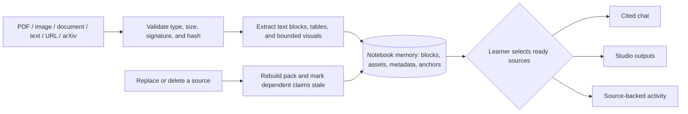

# Feynman AI

Feynman AI is an adaptive Learning OS. Its core object is an active learning goal: a learner states a capability, confirms a learning contract, completes an observable task, records evidence, and receives one next best action. Reading, chat, and generated answers do not change learner state on their own.

The primary loop is:

`Goal -> Learning Contract -> Adaptive Route -> Active Task -> Evidence -> Next Best Action`

Source context and learner state are deliberately separate. Notebook/source memory holds extracted material and anchors; learner memory holds goal state and observable evidence. A course receives only the evidence a learner explicitly shares, and that share can be revoked.

## OpenAI Build Week: how Codex and GPT-5.6 were used

Feynman was built with Codex + GPT-5.6 as an engineering and verification partner, not as an unbounded answer box for learners. We used them to design and implement the typed learning contracts, durable route and evidence state, source-scoped feedback boundaries, Django/Next.js integration, regression tests, and browser-based failure reproduction and repair.

The result is intentionally inspectable: a learner's route advances from an observable attempt, not from a generated explanation or chat history. The application keeps provider credentials server-side, records model/provider provenance when generation is used, and does not forward end-user prompts to Codex desktop authentication. The setup, verification commands, and manual browser smoke flow below make that path repeatable.

## Notebook Source Desk pipeline

The Source Desk turns an explicitly added PDF, pasted text, public webpage, or arXiv reference into notebook-scoped source memory:



Uploaded raw bytes and fetched raw HTML are used only for extraction and then discarded. Durable notebook state contains normalized blocks, visual assets, metadata, hashes, and anchors. PDF extraction prefers Mistral OCR when configured and exposes a local fallback when it is not; public URLs are bounded and cleaned, and arXiv `/abs/...` links are normalized to their PDF export. Deleting or replacing a source rebuilds the pack and marks dependent artifacts, chats, curricula, and source-supported evidence stale rather than silently retaining unsupported claims.

## What Feynman supports

- **Sources:** PDF, image, text/Markdown/CSV, Word, PowerPoint, pasted text, public webpages, and arXiv references.
- **Source-grounded Studio:** study guides, quizzes, slide decks, flashcards, formula sheets, source tables, mind maps, narrated lessons, and cited notebook notes.
- **Active workbenches:** generic predict/explain/apply/debug/transfer routes plus specialized DSP, Operating Systems, Computer Graphics, AI/ML, historical-source analysis, and academic medical-mechanism activities.
- **Evidence tools:** source selection, page/block/visual citations, structured attempts, confidence capture, remediation, retry, changed-case transfer, and stale-source invalidation.

These are learning tools, not mastery buttons: a learner's state changes only after an observable attempt is evaluated. Medical activities remain academic and source-cited; financial learning never becomes personalized investment advice.

## Primary routes

Start at `http://127.0.0.1:3000/` after both services are running.

| Route | Purpose |
| --- | --- |
| `/` | Universal goal entry: state what you want to become able to do. |
| `/onboarding` | Register or sign in without losing a pending goal intent. |
| `/home` | Current next action, active goals, recent evidence, and source status. |
| `/goals/new` | Review and confirm the editable learning contract. |
| `/goals/[goalId]` | Goal overview, route, evidence state, and source boundary. |
| `/goals/[goalId]/learn` | Active-practice workspace with Source Dock, one Activity Canvas task, and Evidence Rail. |
| `/evidence` | Learner-owned evidence timeline and explicit course sharing. |
| `/settings/privacy` | Learner-memory controls and immediate share revocation. |
| `/teach`, `/institution`, and `/courses/[courseId]` | Role-gated instructor, institution, and course views. |

The universal Source Desk is reached at `/sources` or from a goal's Source Dock at `/sources?goal=<goalId>`. It creates a source-bounded notebook, accepts files, pasted text, references, and blank notes, and supports selected-source answers with source/page anchors. `/study/new` is retained only as a compatibility redirect.

## Local quick start

See the complete setup, CORS/CSRF configuration, and browser smoke test in [`docs/runbook.md`](docs/runbook.md).

```powershell
# terminal 1
cd backend
python -m venv .venv
.\.venv\Scripts\Activate.ps1
pip install -r requirements.txt
Copy-Item .env.example .env
python manage.py migrate
python manage.py runserver 127.0.0.1:8000 --noreload

# terminal 2
cd frontend
npm.cmd install
Copy-Item .env.example .env.local
npm.cmd run dev -- --hostname 127.0.0.1
```

The browser-facing API base defaults to `http://127.0.0.1:8000/api/v1` and can be changed with `NEXT_PUBLIC_API_BASE_URL` before the frontend starts.

## Verification

```powershell
# backend
cd backend
python manage.py check
python manage.py makemigrations --check --dry-run
python -m pytest -q

# frontend
cd frontend
npm.cmd run typecheck
npm.cmd test
npm.cmd run build
```

The manual browser sequence is documented in the runbook. It covers registration, goal creation and contract confirmation, an observable attempt, source persistence and citations, and course-sharing revocation.

## Provider boundary and secondary legacy paths

Goal Mode account, contract, route, and evidence flows do not require a browser-exposed provider credential. Keep all provider keys server-side.

The secondary dynamic-study path remains available for compatibility:

- `/sources` is the Source Desk entry point and can also be used without a goal attachment. `/study/new` redirects there for compatibility.
- `/study/workspace` and `/subjects` are legacy dynamic-module routes, not the default learner entry.
- `POST /api/v1/study-sources/ingest` and `POST /api/v1/study-plans` support the legacy source-ingestion/module-builder path.

The module builder uses the server-side OpenAI provider when configured. The deterministic fixture is retained for automated tests and is not a silent replacement for a failed live response. Provider failures must remain visible to the learner.

## Repository layout

- `frontend/` - Next.js App Router client
- `backend/` - Django REST API, authentication, goals, evidence, sharing, and source runtime
- `contracts/` - versioned JSON contracts, source packs, and frozen evaluation cases
- `docs/` - architecture, source provenance, and local operations documentation
